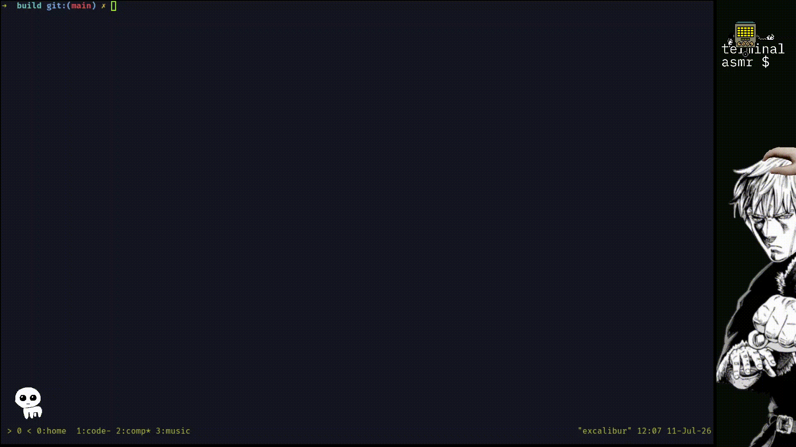
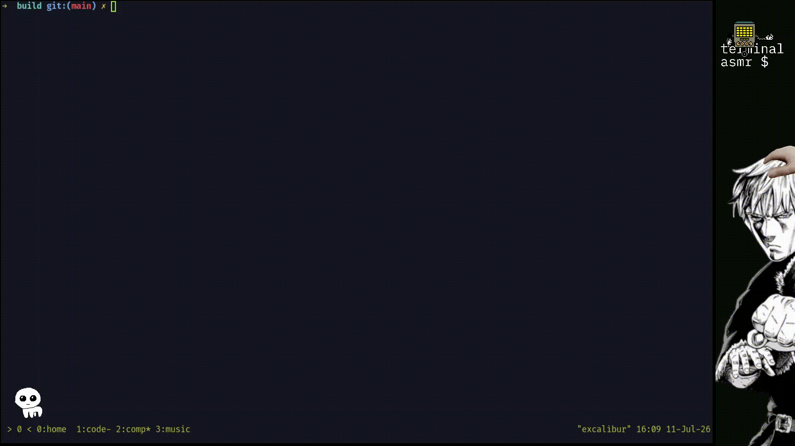

# Sentyper

A cli based typing application written in C.
You can easily compile this program with the
C compiler of your choice. Just create a `build` 
directory, go to the build directory and run `cmake ..` 
after that you could just run `make`.

### Here's the demo gif of the application

